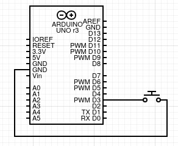
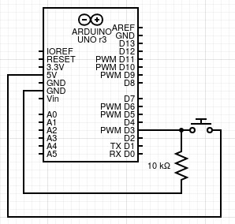

# gButton

gButton is an Arduino library aimed to simplify the use of buttons and other momentary contact switches.

Buttons are not inherently difficult to manage, but doing that from the ground up can fill your sketch with boilerplate code, distracting you from what is really important, building an awesome project!

This library exposes only one simple yet capable class that takes care of all the configuration and keeps track of the button state at all times for you.

### Usage

To start create a new button object 

    gButton myButton(3);

Here you declare a button connected to `D3` on the Arduino board, and here is the first simplification, you only need to connect one terminal of the button to `D3` and the other to `GND`, no resistor is needed.

##### How is this possible?

This library make use of the underrated internal pull-up resistors present in the pins, making the wiring simpler.
You can still use an external resistor if you preferred, but you must pass an extra argument to the constructor telling that you don't want to use the internal pull-up.

    gButton myButton(3, false);

As you can see, the wiring is much simpler using the internal pull-up.

Then you must call the `begin()` method in the setup.

    #include "gButton.h"

    gButton myButton(3);

    void setup(){
      myButton.begin();

      ... extra configurations
    }

    void loop(){
      ... your code
    }

The `begin()` method initialize the button to the correct configurations, the only thing left is for you to read the various states and functionalities available.

### down

The method `down()` returns a boolean indicating if the button has been pressed since the last time it was updated.

    myButton.down()

Returns:

* `true`: if the button has been pressed.
* `false`: otherwise.

> This method will return true as soon you press the button.

___

### up

The method `up()` returns a boolean indicating if the button has been released since the last time it was updated.

    myButton.up()

Returns:

* `true`: if the button has been released.
* `false`: otherwise.

> This method will return true as soon you release the button.

___

### sustained

The `sustained()` method returns a boolean indicating if the button is being pressed.

    myButton.sustained()

Returns:

* `true`: if the button is being pressed.
* `false`: otherwise.

> This method will return true as long as you keep the button press.

___

### change

The `change()` method returns a boolean indicating if the button state has changed.

    myButton.change()

Returns:

* `true`: any time the state change.
* `false`: otherwise.

> This method will return true every time it goes from up to down and vise versa.

___

### toggle

The `toggle()` method returns a boolean with alternating values every time you press the button.

    myButton.toggle()

Returns:

* A boolean value alternating between `true` and `false` every time the button is pressed.

> The first value that this method return is false, and will alternate as soon as the button is pressed.
___

### toggleUp

The `toggleUp()` method returns a boolean with alternating values every time you release the button.

    myButton.toggleUp()

Returns:

* A boolean value alternating between `true` and `false` every time the button is released.

> The first value that this method return is false, and will alternate as soon as the button is released.

___

### multiClick

The `multiClick()` method returns a boolean indicating that the button has been consecutively pressed the required number of times.

This method can imitate the behavior of a double click, for example.

    myButton.multiClick( numberOfClicks )

Where:

* `numberOfClicks`: is a number between 0 and 255 indicating the number of times the button need to be pressed before it returns true. You can omit this argument and the default value of `2` will be used.

Returns:

* `true`: if the button is being pressed the required number of times.
* `false`: otherwise.

> The clicks will register as soon the button is pressed.

> The clicks must be made with at most `timeOut` milliseconds between each. If more time passes after the last click registered, the count will restart.

> `timeOut` as a default value of 300ms.

If you call this method multiple times between each update(), only the first one or the one with the smallest argument will be able to return true, the others will always return false.

    void loop(){
      if(myButton.multiClick(5))
      {...}

      if(myButton.multiClick(2))
      {...}
    }

Will be equivalent to:

    void loop(){
      if(myButton.multiClick(2))
      {...}

      if(myButton.multiClick(2))
      {...}
    }

And only the first one will return true.
___

### multiClickUp

The `multiClick()` method returns a boolean indicating that the button has been consecutively released the required number of times.

This method can imitate the behavior of a double click, for example.

    myButton.multiClickUp( numberOfClicks )

Where:

* `numberOfClicks`: is a number between 0 and 255 indicating the number of times the button need to be released before it returns true. You can omit this argument and the default value of `2` will be used.

Returns:

* `true`: if the button is being released the required number of times.
* `false`: otherwise.

> The clicks will register as soon the button is released.

> The clicks must be made with at most `timeOut` milliseconds between each. If more time passes after the last click registered, the count will restart.

> `timeOut` as a default value of 300ms.

If you call this method multiple times between each update(), only the first one or the one with the smallest argument will be able to return true, the others will always return false.

    void loop(){
      if(myButton.multiClickUp(5))
      {...}

      if(myButton.multiClickUp(2))
      {...}
    }

Will be equivalent to:

    void loop(){
      if(myButton.multiClickUp(2))
      {...}

      if(myButton.multiClickUp(2))
      {...}
    }

And only the first one will return true.

___

### debounceTime

The `debounceTime()` lets you get or set the time used in the debounce filter.

If used without arguments, it returns the time in milliseconds currently used in the debounce filter.

    myButton.debounceTime()
  
Returns:

* A number representing the time used in the filter in milliseconds.

But if the method is called with an argument, the time used will be overwritten.

    myButton.debounceTime( time )

Where:

* `time`: is a number between 0 and 65,535 representing the debounce time to be used, in milliseconds.

> The default value of the debounce time is `50ms`.

___

### timeOut

The `timeOut()` lets you get or set the time used to register a click in the `multiClick()` and `multiClickUp()` methods.

This is the time the class will wait after the last click registered before restarting the count.

The `delay()` function is NOT used for this.

If used without arguments, it returns the time in milliseconds currently used as time-out.

    myButton.timeOut()
  
Returns:

* A number representing the time used as time-out in milliseconds.

But if the method is called with an argument, the time used will be overwritten.

    myButton.timeOut( time )

Where:

* `time`: is a number between 0 and 65,535 representing the time used as time-out, in milliseconds.

> The default value of the timeOut is `300ms`

> To work properly, the `timeOut` must be greater than `debounceTime`.